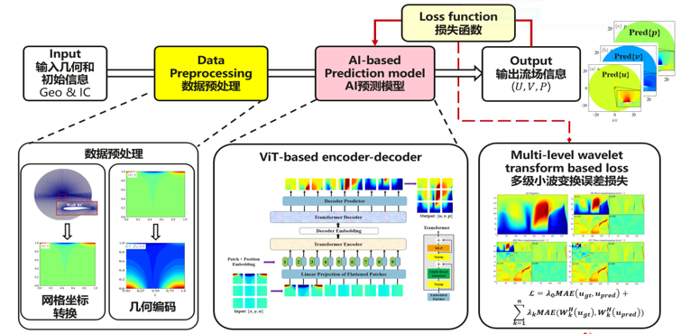
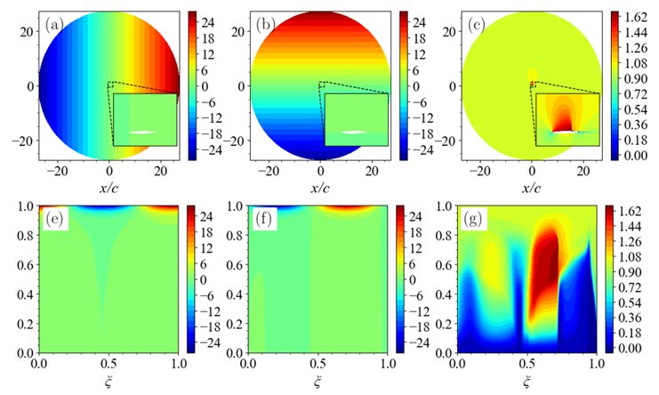
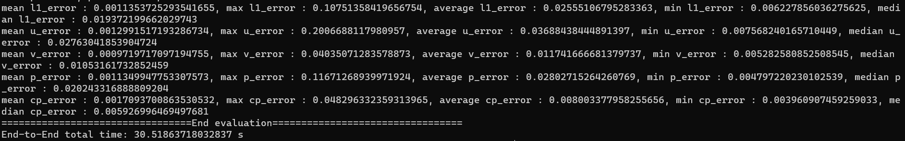

# ViT模型自验报告

作者姓名：陈博
邮箱：cb_sjtu@sjtu.edu.cn

作者姓名: 王晨宇
邮箱:  WCYaerospace@sjtu.edu.cn

## 1. 模型简介

在这一部分，我们将简要介绍模型的结构，所用的数据集，以及代码仓库的地址。

### 1.1. 网络模型结构

ViT（Vision Transformer）模型主要基于昇腾AI打造的面向大型客机翼型流场高效高精度AI预测仿真模型 ViT-based encoder-decoder, 基本模型的输入为坐标转换后所生成的翼型几何信息和气动参数；模型的输出为转换后生成的流场物理量信息，如速度和压力。利用多级小波变换损失函数训练网络的权重。对流场中突变高频信号进行进一步地分解学习，进而提升流场剧烈变化区域（如激波）的预测精度，如图loss function对应的模块；


### 1.2. 数据集

本模型使用了数据集，该数据集主要包含...（在这里简单介绍所提交的数据集）
该文件包含2808个流场数据，为51个超临界翼型在Ma=0.73和不同攻角范围内（-2.0~4.6）的流场数据。其中，input的数据维度为（13, 192, 384），192和384为经过雅格比转换后的网格分辨率，13为不同的特征维度，分别为($AOA$, $x$, $y$, $x_{i,0}$, $y_{i,0}$, $\xi_x$, $\xi_y$, $\eta_x$, $\eta_y$, $x_\xi$, $x_\eta$, $y_\xi$, $y_\eta$)。

Label的数据维度为（288，768），可以经过[utils.py](mindflow.cell.utils)中的patchify 函数(16×16)操作后所得的流场数据（u,v,p），可以通过[utils.py](mindflow.cell.utils)中的unpatchify操作还原成（3, 192, 384），用户可根据自身网络输入输出设计进行个性化配置和选择。

首先将CFD的数据集转换成张量数据，然后将张量数据转换成MindRecord。设计AI数据高效转换工具，实现翼型流场复杂边界和非标数据的特征提取，转换前后的x，y和u的信息如下图所示。




### 1.3. 代码提交地址

代码仓库地址：[GitHub Repo](https://github.com/Tyrant-sudo/acend_competition/tree/master/code)  

### 1.4. 其它

## 2. 代码目录结构说明

本项目的目录结构和文件遵循model zoo代码目录规范，具体如下：

project-root-directory  
│  
├── src  
│ ├── __init__.py  
│ ├── dataset.py  
│ ├── utils.py  
│ ├── visualization.py  
├── data  
│ ├── flowfield_000_050.mind  
| ├── flowfield_000_050.mind.db  
| ├── test_dataset.mind  
| ├── test_dataset.mind.db  
| ├── train_dataset.mind  
| ├── train_dataset.mind.db  
├──  configs  
│ ├── vit.yaml  
├── test.py  
└── train.py  


## 3. 自验结果

在这一部分，我们将展示自验的结果，包括所用的MindSpore版本，自验环境，自验精度结果，以及论文精度。我们推荐提供截图作为参考。

### 3.1. 自验环境

- 所用硬件环境：英伟达A100
- MindSpore版本：2.1.0
- Python第三方库：...

### 3.2. 训练超参数

- batch_size: 32
- epoch: 500
- learning rate: 0.0005,并且通过get_warmup_cosine_annealing_lr函数进行了一些调整。
- loss function: 代码中使用了WaveletTransformLoss作为损失函数,wavelevel 取1
- optimizer: 代码中使用了nn.Adam作为优化器，优化的参数包括模型的可训练参数和损失函数的可训练参数。
- 并行度: 1

### 3.3. 训练

#### 3.3.1. 如何启动训练脚本

训练如何启动：

```shell
$ python test.py 
```

### 3.4 测试

#### 3.4.1. 如何启动测试脚本
```shell
$ python your_script.py --ckpt_path ./path_to_your_checkpoint.ckpt
```
